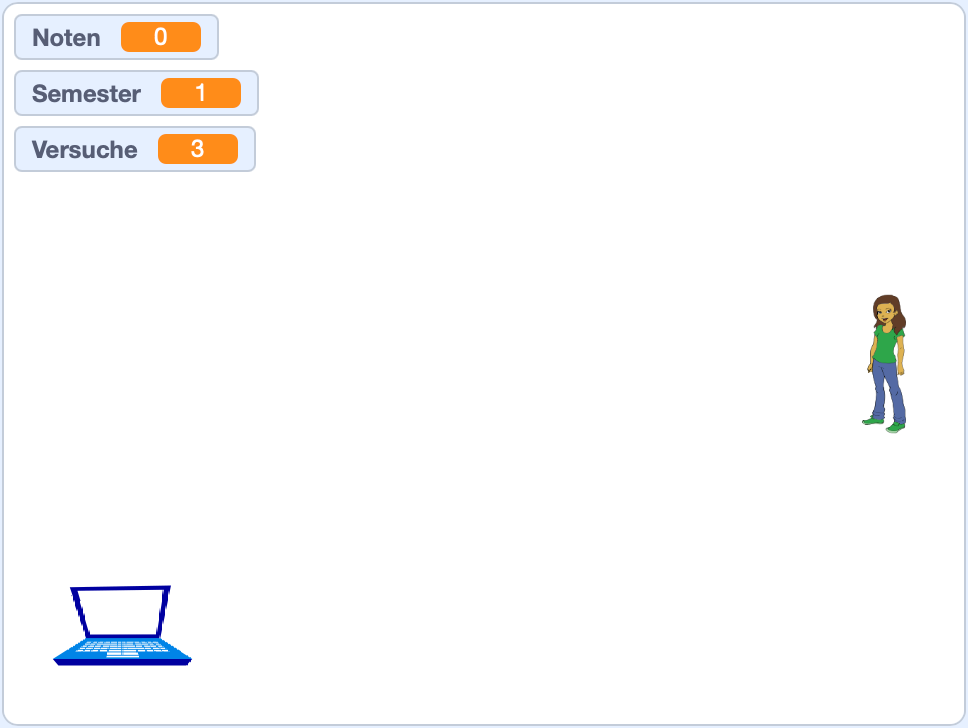

# Catch Grades

Ein kleines Spiel in [Scratch](https://scratch.mit.edu/) mit einer
Schritt-für-Schritt-Anleitung.

## Wie spiele ich es?

1. Lade die Datei _scratch_project_catch-grades.sb3_ auf deinen Computer.
2. Öffne den [Scratch Editor](https://scratch.mit.edu/projects/editor/) im
   Webbrowser.
3. Öffne die Datei _scratch_project_catch-grades.sb3_ über "Datei" > "Von deinem
   Computer hochladen".
4. Klicke auf die grüne Flagge, um das Spiel zu starten.

Das Ziel ist 30 Noten zu sammeln, ohne zu viele schlechte Noten zu bekommen.

## Wie erstelle ich das Spiel in Scratch?

Es gibt eine [Schritt-für-Schritt-Anleitung](./tutorial.md), wie man das Spiel
in Scratch erstellt. Zu finden ist die Anleitung in
[tutorial.md](./tutorial.md).
