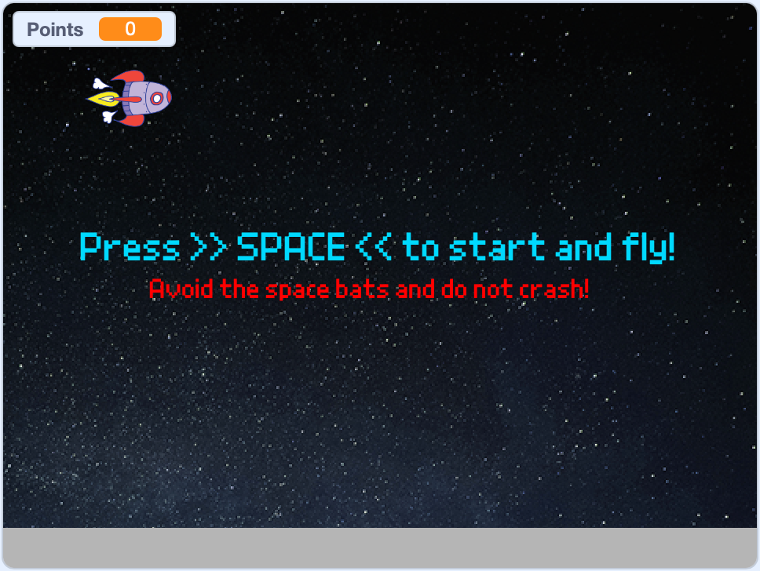

# Space Bats

A simple game in [Scratch](https://scratch.mit.edu/) with a step-by-step
tutorial.

## How to play

1. Download the _scratch_project_space-bats.sb3_ to your computer.
2. Open the [Scratch Editor](https://scratch.mit.edu/projects/editor/) in your
   browser.
3. Open the _scratch_project_space-bats.sb3_ file with "File" > "Load from your
   computer".
4. Click on the green flag to start the game and follow the instructions.

## How to create a Space Bats game

There is a [tutorial with step-by-step instructions](tutorial.md) how to create
a Space Bats game in Scratch. You can find the tutorial in
[tutorial.md](tutorial.md).
