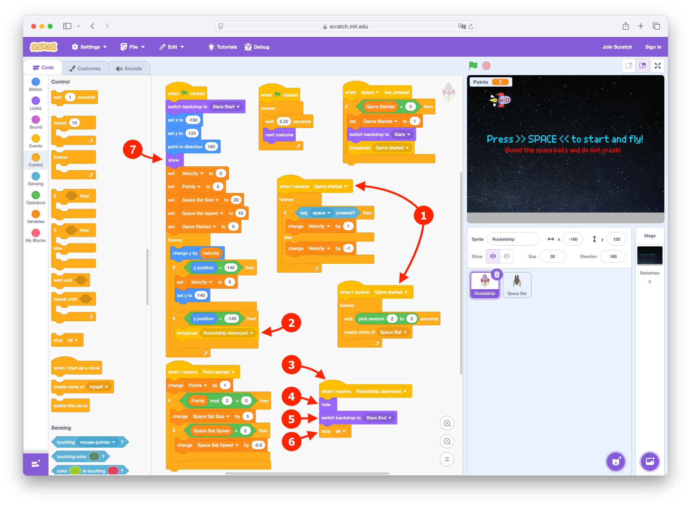
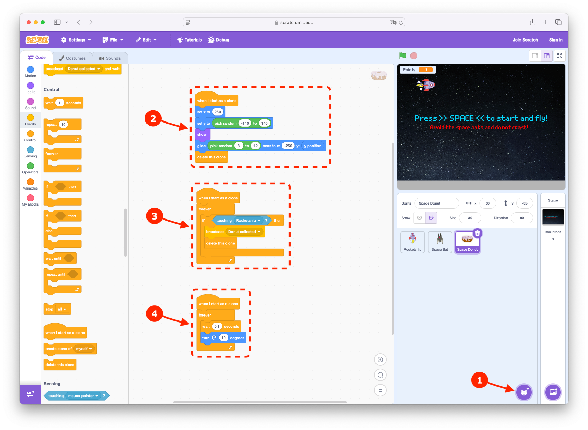
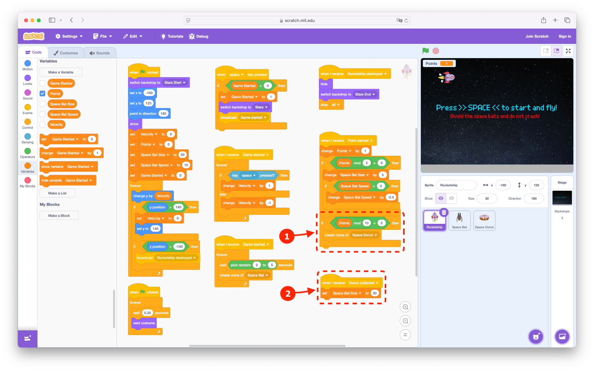
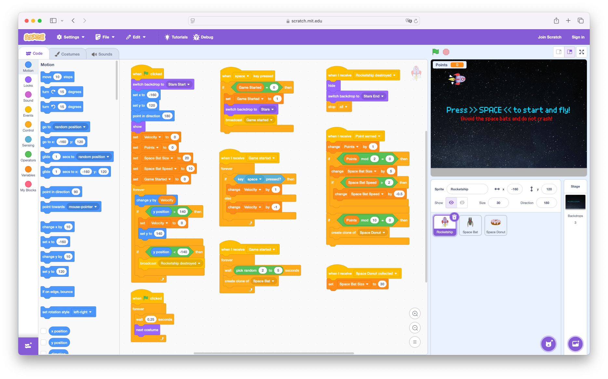
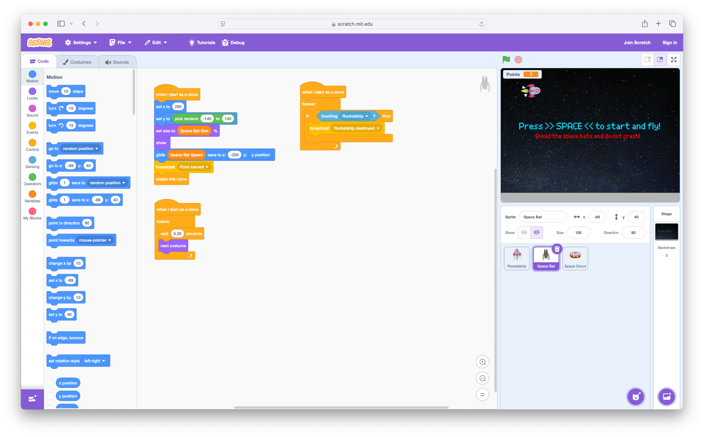
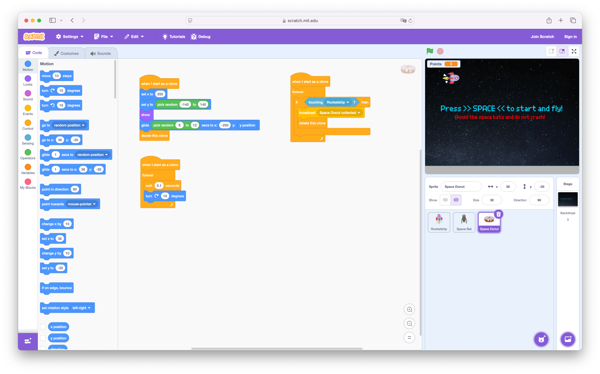

# How to create a Space Bats game

<!--toc:start-->

- [How to create a Space Bats game](#how-to-create-a-space-bats-game)
  - [Introduction](#introduction)
  - [Setup](#setup)
  - [Create the Game](#create-the-game)
    - [Create the Background](#create-the-background)
    - [The Rocketship](#the-rocketship)
      - [Create Rocketship](#create-rocketship)
      - [Add Rocketship Movement](#add-rocketship-movement)
    - [The Space Bat](#the-space-bat)
      - [Create Space Bat](#create-space-bat)
      - [Add Space Bat Movement](#add-space-bat-movement)
      - [Add Space Bat Collision](#add-space-bat-collision)
      - [Add Space Bat to the Game](#add-space-bat-to-the-game)
    - [Add Points](#add-points)
    - [Add Animation](#add-animation)
  - [Enhancements](#enhancements)
    - [Add Game Difficulty](#add-game-difficulty)
    - [Add Start und End Screen](#add-start-und-end-screen)
    - [Add a Space Donut](#add-a-space-donut)
  - [The Final Code](#the-final-code)
    - [Rocketship](#rocketship)
    - [Space Bat](#space-bat)
    - [Space Donut](#space-donut)
    <!--toc:end-->

## Introduction

This is a tutorial for creating a Space Bats game in
[Scratch](https://scratch.mit.edu/).

## Setup

1. Open the [Scratch Editor](https://scratch.mit.edu/projects/editor/) in your
   browser to start with a new project. If you already have a project open, you
   can also use the "File" menu and select "New" to create a new one.

   

2. Remove the default cat sprite from the project by clicking on the trash
   symbol on `Sprite1`.

   

## Create the Game

### Create the Background

1. Click on the existing backdrop "Backdrops1" and select the "Backdrops" tab.

   

2. Create a new backdrop by clicking on the "Choose a Backdrop" button on the
   bottom left and select "Stars" from the list. There is a search field at the
   top, so you can also search for the backdrop.

   

3. Name the new created backdrop "Stars" and draw a small gray filled rectangle
   at the bottom to show there is a planet nearby.

   

4. The initial backdrop "backdrop1" can be removed by clicking on the trash
   symbol.

   

### The Rocketship

#### Create Rocketship

1. Create a new sprite by clicking on the "Choose a Sprite" button and select
   "Rocketship" from the list. There is a search field at the top, so you can
   also search for the sprite.

   

2. Set the properties of the "Rocketship" sprite to the following values:

   | Property  | Value       |
   | --------- | ----------- |
   | x         | -160        |
   | y         | 120         |
   | Show      | Show sprite |
   | Size      | 30          |
   | Direction | 180         |

   

3. Now drag a "when green flag clicked" event block in the Code tab of the
   "Rocketship" sprite.

   

4. Drag and connect the following motion blocks to define the default properties
   of the "Rocketship" sprite to reset it to its initial properties on game
   start:

   | Block              | value |
   | ------------------ | ----- |
   | set x to           | -160  |
   | set y to           | 120   |
   | point in direction | 180   |

   

#### Add Rocketship Movement

1. Rename the existing variable "my variable" in Variables to "Velocity" and add
   a "set [Velocity] to (0)" block.

   | Variable | Value | Description                                                                            |
   | -------- | ----- | -------------------------------------------------------------------------------------- |
   | velocity | 0     | The velocity in pixel at which the rocket falls onto the planet or moves away from it. |

   

   

2. Add a "forever" control block and add a "change y by" motion block. Then move
   the "Velocity" variable into the value field of the "change y by" block.

   | Category | Block                    |
   | -------- | ------------------------ |
   | Control  | "forever"                |
   | Motion   | "change y by [Velocity]" |

   

   

   

3. Add a second "when green flag clicked" event block with a "forever" control
   block.

   | Category | Block                     |
   | -------- | ------------------------- |
   | Events   | "when green flag clicked" |
   | Control  | "forever"                 |

   

4. Add a "if < > then else" control block with a "key [space] pressed?" sensing
   block inside the "forever" block.

   | Category | Block                  |
   | -------- | ---------------------- |
   | Control  | "if < > then else"     |
   | Sensing  | "key [space] pressed?" |

   

5. Inside the "if" part, add a "change [Velocity] by" variable block with a
   value of 1 and in the "else" part add a "change [Velocity] by" variable block
   with a value of -1.

   | Category  | Block                       |
   | --------- | --------------------------- |
   | Variables | "change [Velocity] by (1)"  |
   | Variables | "change [Velocity] by (-1)" |

   

6. To prevent the rocketship from disappearing from the screen, we limit the
   maximum and minimum y-position of the rocketship sprite.

   | Limits | Value | Description                                                 |
   | ------ | ----- | ----------------------------------------------------------- |
   | Max    | 140   | Upper y-position on the screen.                             |
   | Min    | -140  | Lower y-position at which the rocket crashes to the ground. |

   Add two "if < > then" control blocks with the following blocks inside:

   | Category  | Block                 |
   | --------- | --------------------- |
   | Operators | "( ) > (140)"         |
   | Motion    | "y position"          |
   | Variables | "set [Velocity] to 0" |
   | Motion    | "set y to (140)"      |

   | Category  | Block          |
   | --------- | -------------- |
   | Operators | "( ) < (-140)" |
   | Motion    | "y position"   |
   | Control   | "stop [all]"   |

   

   Move booth "if < > then" control blocks inside the "forever" block of the
   first "when green flag clicked" block.

   

> [!NOTE]
>
> Now, if you press the green flag, the rocketship should move down and crashes
> to the ground or if space is pressed, it should move up.

### The Space Bat

#### Create Space Bat

1. Create a new sprite by clicking on the "Choose a Sprite" button and select
   "Bat" from the list. Set the following properties of the "Bat" sprite:

   | Property | Value       |
   | -------- | ----------- |
   | Sprite   | Space Bat   |
   | Show     | Hide sprite |

   

2. In the Code tab of the "Bat" sprite, add a "when I start as a clone" control
   block and add the following blocks:

   | Category  | Block                         |
   | --------- | ----------------------------- |
   | Motion    | "set x to (250)"              |
   | Motion    | "set y to ( )"                |
   | Operators | "pick random (-140) to (140)" |
   | Looks     | "set size to (30) %"          |
   | Looks     | "show"                        |

   

#### Add Space Bat Movement

1. Add the following blocks:

   | Category | Block                              |
   | -------- | ---------------------------------- |
   | Motion   | "glide (10) secs to x:(-250) y:()" |
   | Motion   | "y position"                       |
   | Control  | "delete this clone"                |

   

#### Add Space Bat Collision

1. Add a new "when I start as a clone" control block and add the following
   blocks:

   | Category | Block                     |
   | -------- | ------------------------- |
   | Control  | "forever"                 |
   | Control  | "if < > then"             |
   | Sensing  | "touching [Rocketship] ?" |
   | Control  | "stop [all]"              |

   

#### Add Space Bat to the Game

1. In the Code tab of the "Rocketship" sprite, add a "when green flag clicked"
   event block and add the following blocks:

   | Category  | Block                    |
   | --------- | ------------------------ |
   | Control   | "forever"                |
   | Control   | "wait ( ) seconds"       |
   | Operators | "pick random (2) to (5)" |
   | Control   | "create clone of [Bat]"  |

   

> [!NOTE]
>
> Now Space Bats appear, which have to be dodged with the Rocketship. If we
> touch one, the game is over.

### Add Points

Every Space Bat that passes the rocketship gives us one point.

1. In the Code tab of the "Space Bat" sprite, in the first "when I start as a
   clone" control block add a "broadcast (message1)" event block. Name the
   message "Point earned".

   | Category | Block                      |
   | -------- | -------------------------- |
   | Events   | "broadcast (Point earned)" |

   

   

2. In the Code tab of the "Rocketship" sprite, add a new variable "Points" and
   set it to 0.

   | Category  | Block                      |
   | --------- | -------------------------- |
   | Variables | make new variable "Points" |
   | Variables | "set [Points] to (0)"      |

   

3. In the Code tab of the "Rocketship" sprite, add a "when I receive [Point
   earned]" event block and change the variable Points by 1:

   | Category  | Block                           |
   | --------- | ------------------------------- |
   | Events    | "when I receive [Point earned]" |
   | Variables | "change [Points] by (1)"        |

   

> [!NOTE]
>
> Now we can earn points by passing Space Bats.

### Add Animation

1. In the Code tab of the "Rocketship" sprite, add a new "when green flag
   clicked" event block with the following blocks:

   | Category | Block                 |
   | -------- | --------------------- |
   | Control  | "forever"             |
   | Control  | "wait (0.25) seconds" |
   | Looks    | "next costume"        |

   

   In the Costumes tab remove the "rocketship-e" costume.

   

2. In the Code tab of the "Space Bat" sprite, add a new "when I start as a
   clone" control block with the same blocks.

   

> [!NOTE]
>
> Now the Rocketship and the Space Bats are animated.

## Enhancements

### Add Game Difficulty

1. In the Code tab of the "Rocketship" sprite, add two new variables "Space Bat
   Size" and "Space Bat Speed", set them to 20 and 10 and remove the check
   marks.

   | Category  | Block                               |
   | --------- | ----------------------------------- |
   | Variables | make new variable "Space Bat Size"  |
   | Variables | make new variable "Space Bat Speed" |
   | Variables | "set [Space Bat Size] to (20)"      |
   | Variables | "set [Space Bat Speed] to (10)"     |

   

2. In the "when I receive [Point earned]" event block, add the following blocks:

   | Category  | Block                                |
   | --------- | ------------------------------------ |
   | Control   | "if < > then"                        |
   | Operators | "( ) = (0)"                          |
   | Oprtators | "( ) mod (2)"                        |
   | Variables | "Points"                             |
   | Variables | "change [Space Bat Size] by (5)"     |
   | Control   | "if < > then"                        |
   | Operators | "( ) > (2)"                          |
   | Variables | "Space Bat Speed"                    |
   | Variables | "change [Space Bat Speed] by (-0.5)" |

   

3. In the Code tab of the "Space Bat" sprite, use the "Space Bat Size" and
   "Space Bat Speed" variables.

   

> [!NOTE]
>
> Now the level of difficulty increases as the points increase.
>
> - The Space Bats get bigger and faster.

### Add Start und End Screen

1. Select the "backdrops1" stage and duplicate the current one two times.

   - Name the first "Stars Start", the second "Stars" and the third "Stars End".

   

2. Select the "Stars Start" backdrop and convert it to a vector graphic.

   - Set a blue color.
   - Select the "Pixel" font.
   - Add the Text: `Press >> SPACE << to start and fly!`
   - Set a larger size and a centered position. (Click on the select button
     (Arrow) and the size and position of the selected text can be adjusted.)
   - Set a red color.
   - Add the Text: `Avoid the space bats and do not crash!`
   - Set a smaller size and a centered position.

   

3. Select the "Stars End" backdrop and convert it to a vector graphic.

   - Set a blue color.
   - Select the "Pixel" font.
   - Add the Text: `You LOST!`
   - Set a larger size and a centered position.

   

4. In the Code tab of the "Rocketship" sprite, add a new variable "Game Started"
   and the following blocks:

   | Category  | Block                                       |
   | --------- | ------------------------------------------- |
   | Looks     | "switch backdrop to [Stars Start]"          |
   | Variables | make new variable "Game Started", unchecked |
   | Variables | "set [Game Started] to (0)"                 |

   

   | Category  | Block                        |
   | --------- | ---------------------------- |
   | Events    | "when [space] key pressed"   |
   | Control   | "if < > then"                |
   | Operators | "( ) = (0)"                  |
   | Variables | "Game started"               |
   | Variables | "set [Game started] to (1)"  |
   | Looks     | "switch backdrop to [Stars]" |
   | Events    | "broadcast (Game started)"   |

   

5. Replace the two "when green flag clicked" event blocks with "when I receive
   [Game started]" event blocks.

   - Replace the "stop [all]" control block with "broadcast (Rocketship
     destroyed)" event block.
   - Add the following blocks:

     | Category | Block                                   |
     | -------- | --------------------------------------- |
     | Events   | "when I receive [Rocketship destroyed]" |
     | Looks    | "hide"                                  |
     | Looks    | "switch backdrop to [Stars End]"        |
     | Control  | "stop [all]"                            |

   - Add an "show" block in the first "when green flag clicked" event block.

     | Category | Block  |
     | -------- | ------ |
     | Looks    | "show" |

   

6. In the Code tab of the "Space Bat" sprite, replace the "stop [all]" control
   block with an "broadcast (Spaceship destroyed)" event block.

   | Category | Block                             |
   | -------- | --------------------------------- |
   | Events   | "broadcast (Spaceship destroyed)" |

   

### Add a Space Donut

> [!NOTE]
>
> A collected Space Donut shrinks the Space Bats.

1. Create a new sprite by clicking on the "Choose a Sprite" button and select
   "Donut" from the list. Set the following properties of the "Donut" sprite:

   | Property | Value       |
   | -------- | ----------- |
   | Sprite   | Space Donut |
   | Show     | Hide sprite |
   | Size     | 30          |

   Add the following blocks:

   - Movement:

     | Category  | Block                              |
     | --------- | ---------------------------------- |
     | Control   | "when I start as a clone"          |
     | Motion    | "set x to (250)"                   |
     | Motion    | "set y to ( )"                     |
     | Operators | "pick random (-140) to (140)"      |
     | Looks     | "show"                             |
     | Motion    | "glide (10) secs to x:(-250) y:()" |
     | Motion    | "y position"                       |
     | Control   | "delete this clone"                |

   - Collision:

     | Category | Block                               |
     | -------- | ----------------------------------- |
     | Control  | "when I start as a clone"           |
     | Control  | "forever"                           |
     | Control  | "if < > then"                       |
     | Sensing  | "touching [Rocketship] ?"           |
     | Events   | "broadcast (Space Donut collected)" |
     | Control  | "delete this clone"                 |

   - Rotation:

     | Category | Block                     |
     | -------- | ------------------------- |
     | Control  | "when I start as a clone" |
     | Control  | "forever"                 |
     | Control  | "wait (0.1) seconds"      |
     | Motion   | "turn right (10) degrees" |

   

2. In the Code tab of the "Rocketship" sprite, add the following blocks:

   | Category  | Block                           |
   | --------- | ------------------------------- |
   | Control   | "if < > then"                   |
   | Operators | "( ) = (0)"                     |
   | Oprtators | "( ) mod (10)"                  |
   | Variables | "Points"                        |
   | Control   | "create clone of [Space Donut]" |

   | Category  | Block                                    |
   | --------- | ---------------------------------------- |
   | Events    | "when I receive [Space Donut collected]" |
   | Variables | "set [Space Bat Size] to (30)"           |

   

## The Final Code

### Rocketship

### Space Bat

### Space Donut

